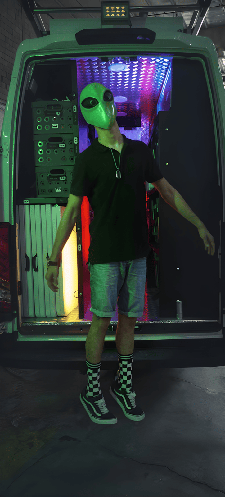

# Media Optimization Guide

The site ships ~240 MB of media. None of it has been compressed in this pass
(to avoid altering visual quality without review). These are the highest-value
opportunities, with ready-to-run commands. **Always keep the originals** and
test the output before replacing production assets.

## Why it matters

- Largest images: `aboutpage/aboutimg2.png` (5.6 MB), `aboutimg1/3/4/5.png`
  (3.4–3.6 MB each), `fleets/caravan/jayco.png` (4.2 MB), several BTS thumbnails.
- Hero video `homepage/hero.mp4` (4.7 MB) autoplays and competes with LCP.
- 13 BTS clips at 4–10 MB each (already lazy-loaded, but still heavy).

## 1. Convert large PNGs → WebP/AVIF

Install once: `brew install webp libavif` (macOS).

```bash
# WebP (broad support, ~80% smaller, visually lossless at q=82)
cwebp -q 82 pages/aboutpage/aboutimg2.png -o pages/aboutpage/aboutimg2.webp

# AVIF (smaller still, modern browsers)
avifenc --min 20 --max 28 pages/aboutpage/aboutimg2.png pages/aboutpage/aboutimg2.avif
```

Then reference with a `<picture>` fallback so older browsers still get PNG:

```html
<picture>
  <source srcset="pages/aboutpage/aboutimg2.avif" type="image/avif">
  <source srcset="pages/aboutpage/aboutimg2.webp" type="image/webp">
  
</picture>
```

Also **resize to display dimensions** — these photos are far larger than they
ever render. e.g. `magick aboutimg2.png -resize 1600x aboutimg2.png` (ImageMagick).

## 2. Recompress the hero + section videos

Install once: `brew install ffmpeg`.

```bash
# H.264, capped bitrate, web-faststart — typically 40–60% smaller
ffmpeg -i pages/homepage/hero.mp4 \
  -vcodec libx264 -crf 24 -preset slow \
  -movflags +faststart -an \
  pages/homepage/hero.optimized.mp4
```

- `-an` strips audio (hero/BTS are muted anyway).
- Consider a **smaller mobile encode** (e.g. 720p) served via `<source media="...">`.
- Add a `poster` image to the hero so something paints instantly before the
  video buffers.

## 3. BTS clips

Same `ffmpeg` recipe. They are already `preload="none"` + lazy-loaded, so this is
about bandwidth, not initial load. Target ≤ 2–3 MB each.

## 4. PDF brochures

The fleet brochures and company profile are ~4.5–5 MB each. Compress with:

```bash
gs -sDEVICE=pdfwrite -dCompatibilityLevel=1.4 -dPDFSETTINGS=/ebook \
   -dNOPAUSE -dBATCH -sOutputFile=out.pdf in.pdf
```

> Note: `files/company-profile.pdf` and `pages/brandimage/company-profile.pdf`
> have the **same byte size but different content** (different MD5). Confirm which
> is current before consolidating; do not assume they are duplicates.

## Quick wins, ranked

1. WebP/AVIF + resize the five `aboutpage` PNGs and `jayco.png`.
2. Re-encode `hero.mp4` + add a poster image.
3. Re-encode BTS clips.
4. Compress PDF brochures.
